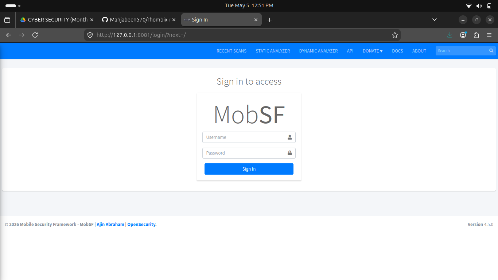
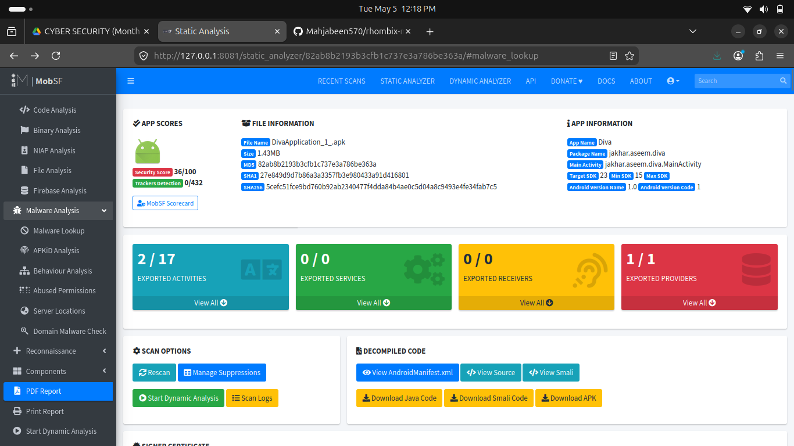
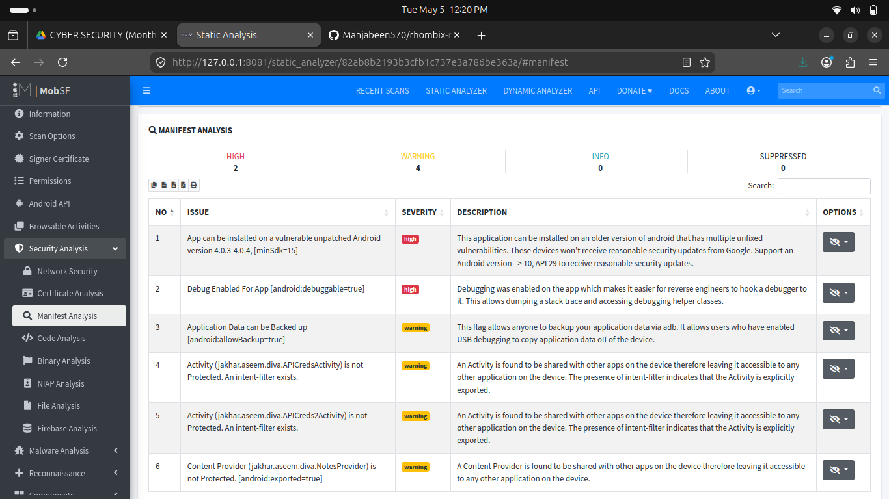
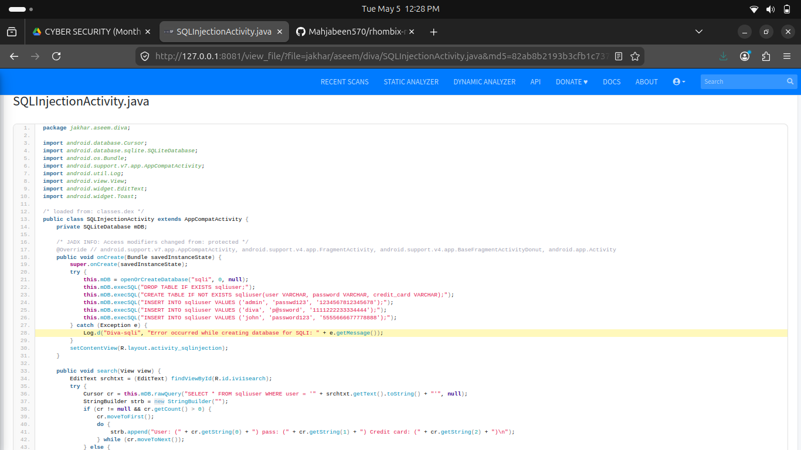
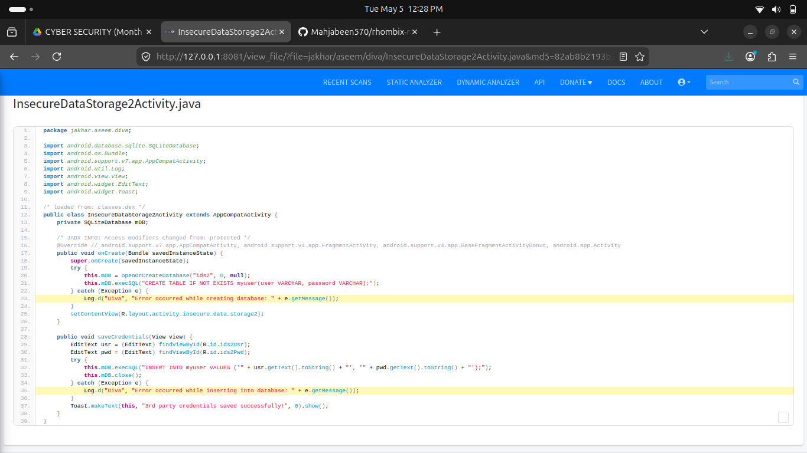

# 🔐 Mobile Application Security Analysis using MobSF

## 📌 Overview

This project demonstrates static security analysis of an Android application using MobSF (Mobile Security Framework).

The tool was deployed using Docker on Ubuntu and used to analyze the DIVA Android application.

---

## ⚙️ Setup

### Step 1: Pull MobSF Docker Image

```
docker pull opensecurity/mobile-security-framework-mobsf:latest
```

### Step 2: Run MobSF

```
docker run -it --rm -p 8081:8000 opensecurity/mobile-security-framework-mobsf:latest
```

### Step 3: Open in Browser

```
http://localhost:8081
```

---

## 🔍 Analysis Steps

* Upload APK file (DivaApplication.apk)
* Start static analysis scan
* Review generated security report

---

## 🚨 Key Findings

* Insecure Data Storage
* Debug Mode Enabled
* Hardcoded Secrets
* Exported Components

---

## 📸 Screenshots

### 🔹 MobSF Dashboard


### 🔹 Security Analysis Results


### 🔹 Security Findings


### 🔹 SQL Injection - Decompiled Code


### 🔹 Insecure Data Storage - Decompiled Code



## 🧠 Learning Outcomes

* Understood Android APK structure
* Learned Static Application Security Testing (SAST)
* Performed reverse engineering using JADX
* Identified common mobile security vulnerabilities

---

## 📄 Report

[Download Report](reports/Report.pdf)

---

## 🎥 Demo Video


---

## 🛠 Tools Used

* MobSF (Mobile Security Framework)
* Docker
* Ubuntu Linux
* JADX (Decompiler)

---

## 🔗 Author

Internship Task - Rhombix Technologies
